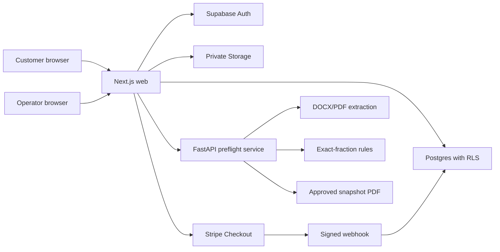

# Architecture

The customer-facing Next.js application owns authentication, private workflow
orchestration, billing and report delivery. The FastAPI service is an internal,
secret-authenticated deterministic computation boundary. Supabase provides Auth,
Postgres and private Storage.

## Trust boundaries

- Browser input is untrusted. Server Actions re-authenticate and validate it.
- `SUPABASE_SECRET_KEY`, Stripe secret, webhook secret and service secret are
  server-only.
- Customer database access uses request-scoped Supabase clients and RLS.
- Service-role access is limited to workflows that first bind the operation to
  the authenticated owner.
- Operator roles come only from signed Auth `app_metadata`.
- The preflight service never receives Stripe or Supabase credentials.
- The browser never marks a payment successful; a signed webhook calls an
  idempotent SQL function.

## Data flow

1. A supported file is size/MIME/extension checked and rate limited.
2. The internal service validates extractable text and produces source-linked
   proposals.
3. The raw file is stored at a random private owner path; metadata, SHA-256 and
   retention deadline are stored separately.
4. The customer corrects proposals and declares a narrow canonical simple-grid
   relationship.
5. An atomic SQL function consumes a credit exactly once.
6. Exact-fraction rules create versioned, explainable findings.
7. An operator approves, suppresses, edits through notes, or adds a manual
   source-linked finding. Database triggers retain before/after snapshots.
8. Release persists an approved snapshot. PDF download renders that snapshot,
   never an unreviewed rerun.
9. Version two reuses assumptions and classifies findings as resolved,
   remaining, or new.

The pilot uses synchronous service calls to keep operations legible. A durable
queue is a later scaling option, not required for the validation volume.
